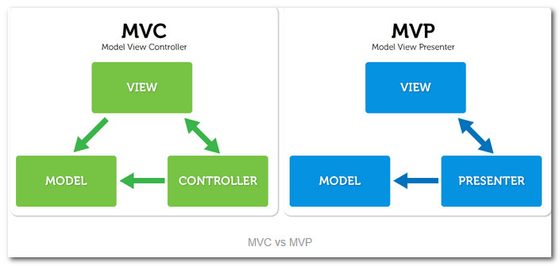

###MVC和MVP模式和MVVM模式
	MVC 模式://所有的通信都是单向的
-
		一种经典的三层架构模式，目的是将数据和视图分离，使他们不相互依赖，符合面向对象设计的单一职责原则.

		组成：Modle模型、View视图、Controller控制器
	
		在 Android 中，分工如下:
			a)Modle模型：业务逻辑和实体模型，数据保存,包含网络请求、数据库读取、文件读取、逻辑运算、业务 Bean 类等。
	
			b)View视图：也叫表示层，与用户实现交互的界面//xml布局文件,addView()等//传送指令到 Controller
	
			c)Controller控制器：调用业务逻辑，然后把得到的数据转发给视图显示给用户.//Activity 或 Fragment ,holder控件部分
		
		优点:将业务场景按展示数据类型划分出多个模块, 每个模块中的C层负责业务逻辑和业务展示拆分在于解耦, 顺便做了减负, 隔离在于重用, 提升开发效率	

		缺点：
			View 对应的 XML 文件实际能做的事情很少，很多界面显示由 Controllor 对应的 Activity 给做了，这样使得 Activity 变成了一个类似 View 和 Controllor 之间的一个东西。造成了 Controller 层非常臃肿。没有区分业务逻辑和业务展示, 对单元测试不友好.

	MVP 模式：//部分之间的通信都是双向的
-
		- 基于MVC模式改进得到的三层架构模式，旨在解决 MVC 的造成Controller控制层臃肿的问题。
		- 使用MVP时，Activity和Fragment变成了MVC模式中View层，Presenter相当于MVC模式中Controller层，处理业务逻辑。
		- 每一个Activity都有一个相应的presenter展示器来处理数据进而获取model。(业务逻辑和实体模型)

		组成: Model模型、View视图、Presenter展示器。
	
		在Android工程中，分工如下：
			a)Modle模型：业务逻辑和实体模型，包含网络请求、数据库读取、文件读取、逻辑运算、业务 Bean 类等等。
		
			b)View视图：Actviity 和 Fragment。先写一个 View 接口，再让相应的 Activity 和 Fragment来实现该接口。有交互动作时，调用Presenter的方法(注意:Activity和Fragment变成了MVC模式中View层)

			c)Presenter展示器：充当View和Model之间的“中间人” ,自己写 Presenter 类来进行 Model 和 View 的交互,决定了你和View交互时发生什么。

		优点：提高代码复用性、增加可拓展性、降低耦合度、代码逻辑更加清晰。带来了友好的单元测试.

		缺点：复杂的业务同时会导致presenter层太大，代码臃肿的问题. 增加了很多的接口和实现类。代码逻辑虽然清晰，但是代码量要庞大一些。

	面试加分技巧:
		C层臃肿大部分是没有拆分好MVC模块, 好好拆分就行了, 用不着MVVM. 而MVC难以测试也可以用MVP来解决, 只是MVP也并非完美, 在VP之间的数据交互太繁琐, 所以才引出了MVVM

	MVVM模式://同MVP 部分之间的通信都是双向的
-
		将 Presenter 改名为 ViewModel，基本上与 MVP 模式完全一致。
		唯一的区别是，它采用双向绑定（data-binding）：View的变动，自动反映在 ViewModel，反之亦然。
		View层不做任何业务逻辑、不涉及操作数据、不处理数据、UI和数据严格的分开
	
		作用:	
			项目代码管理
			解耦不同层次
			通过数据绑定做数据更新, 减少了大量的代码工作, 同时优化了代码逻辑

#具体细节

#MVC
软件可以分为三部分

* 视图（View）:用户界面
* 控制器（Controller）:业务逻辑
* 模型（Model）:数据保存

各部分之间的通信方式如下：

1. View传送指令到Controller
2. Controller完成业务逻辑后，要求Model改变状态
3. Model将新的数据发送到View，用户得到反馈

Tips：所有的通信都是单向的。

#互动模式
接受用户指令时，MVC可以分为两种方式。一种是通过View接受指令，传递给Controller。

另一种是直接通过Controller接受指令

#MVP

MVP模式将Controller改名为Presenter，同时改变了通信方向。

1. 各部分之间的通信，都是双向的
2. View和Model不发生联系，都通过Presenter传递
3. View非常薄，不部署任何业务逻辑，称为"被动视图"(Passive View)，即没有任何主动性，而Presenter非常厚，所有逻辑都部署在那里。

#MVVM

MVVM模式将Presenter改名为ViewModel，基本上与MVP模式完全一致。

唯一的区别是，它采用双向绑定(data-binding)：View的变动，自动反映在ViewModel，反之亦然。

