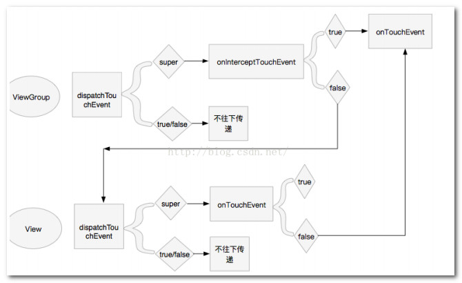
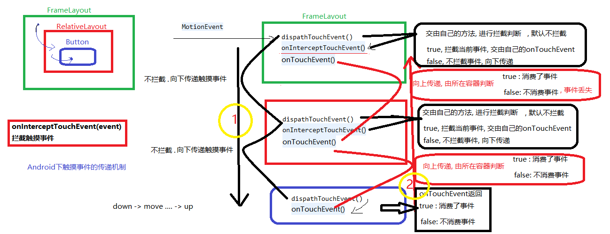
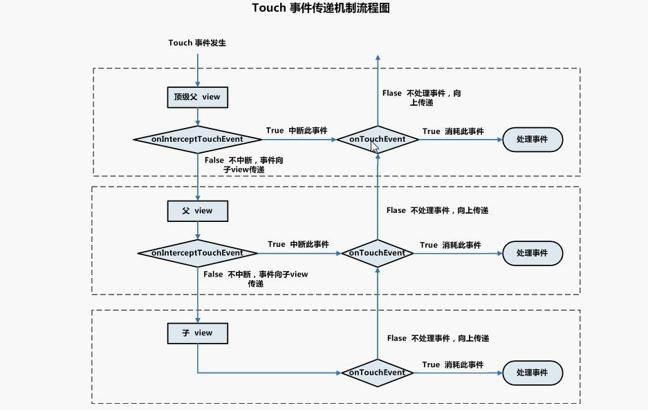
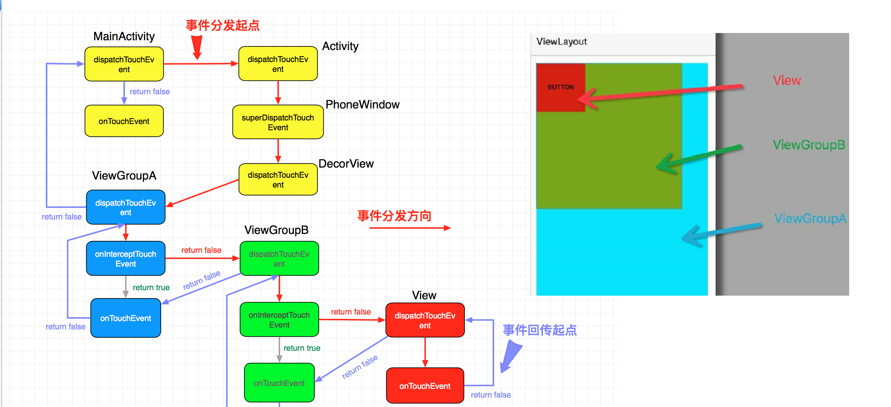

	
	
##3、Touch触摸事件的传递机制。
	一个完整的 touch 事件，由一个 down 事件、n 个 move 事件，一个 up 事件组成.
	Touch 事 件 一 般 的 传 递 流 程 Activity-->window(唯一实现类是PhoneWindow)-->顶级View（DecorView）-->ViewGroup-->View
	
	监 听 Touch 事 件 有 两 种 方 式 ： 
		setOnTouchListener 和 直 接 重 写 三 个 方 法(dispatchTouchEvent、onInterceptTouchEvent()、onTouchEvent() )

	[0]首先补充setOnTouchListener() 与 onTouchEvent()的关系
		onTouch 回调方法，监听touch事件，处理一些事件
		onTouchEvent 处理触摸事件
		调用顺序：onTouch先调用， onTouchEvent后调用
		如果onTouch返回true, onTouchEvent就不会调用
		（参考View源码的dispatchTouchEvent的方法）
		伪代码:
			dispatchTouchEvent(){
				if( onTouch()){
					return true;
				}
				....
				//控件具有点击事件
				if(onTouchEvent()){
					switch 
						case down/up/move等//up时调用performClick()来执行点击，回调点击监听
						onClick()等
					return true;
				}
				
			}
		

	[1]setOnTouchListener//监 听 Touch 事 件 方 式 1
		该方式监听 Touch 事件，优先级较高，如果在 onTouchListener 的 onTouch 方法中 return true 的话，那么 onTouchEvent 方法是接收不到该 Touch 事件的。
		而且因为 onClickListener 中的 onClick 方法实际上是在 onTouchEvent 中被调用的，所以如果 Touch 事件走不到 onTouchEvent 方法的话，点击事件也不会生效
	
	[2]重写的3个方法//监 听 Touch 事 件 方 式 2
		a)dispatchTouchEvent该方法表示对事件进行分发，在这个方法中我们一般return super.dispatchTouchEvent，将该事件分发下去。
		b)onInterceptTouchEvent：该方法表示对 Touch 事件进行拦截，该方法是ViewGroup 特有的，View 没有(当然是因为没有子View啦)。
			ViewGroup 中如果 onInterceptTouchEvent 返在回 true，表示将该事件拦截，那么事件将传递给该 ViewGroup 的 onTouchEvent方法来处理。如果 onInterceptTouchEvent 返回 false 表示不拦截，那么该事件将传递给子 View 的 dispatchTouchEvent 来进行分发。
		c)onTouchEvent：该方法表示对 Touch 事件进行消费，返回 true 表示消费，返回 false 表示不消费那么该事件将传递给父控件的 onTouchEvent 进行处理。

		1.dispatchTouchEvent 分发事件	
		2.onInterceptTouchEvent 拦截孩子的事件 //没有孩子就没有onInterceptTouchEvent()
		3.onTouchEvent 处理消费事件
		面试的时候这么回答:
			[1]Android的事件分发是先传递到父控件(ViewGroup)--再有ViewGroup传递给View的,通过dispatchTouchEvent()方法.
			[2]在ViewGroup中可以通过onInterceptTouchEvent()方法对事件的传递进行拦截. 返回true拦截 ,false不拦截,默认是super(xxx)是false不拦截.
			[3]子View中如果将传递的事件消费掉,事件就不再向上传递,ViewGroup中就无法接收到任何事件
				子View消费:onTouchEvent() 返回true,事件不向上传递; 返回false,事件不消费,层层往上传递给父控件的onTouchEvent()事件.

	补充: Activity与事件传递
		Activity首先获取到事件 调用Activity的dispatchTouchEvent去分发事件
		将事件传递给Activity对应的PhoneWindow, phoneWindow继续将事件往下传递
		如果传递下去没有任何控件消费事件，则会调用Activity的onTouchEvent

点击事件传递顺序 Activity -> Window -> View
> 
	补充: View点击事件的触发和拦截
		[1]点击事件的触发： 
			在View的onTouchEvent处理UP时会调用performClick()来执行点击，回调点击监听
		[2]点击事件的拦截： 
			onInterceptTouchEvent 返回true

View的onTouchEvent默认都会消耗事件,除非它的clickable和longClickable都是false(不可点击),但是enable属性不会影响.