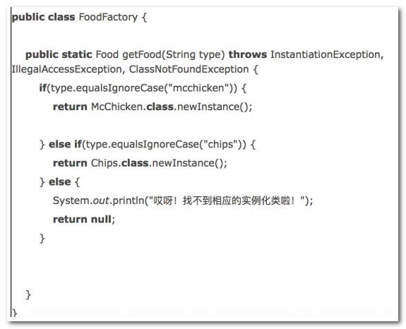
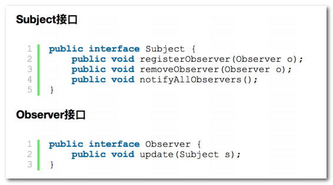
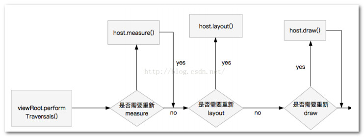
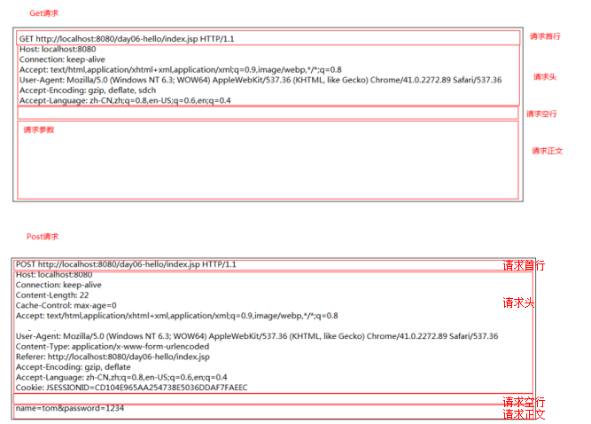
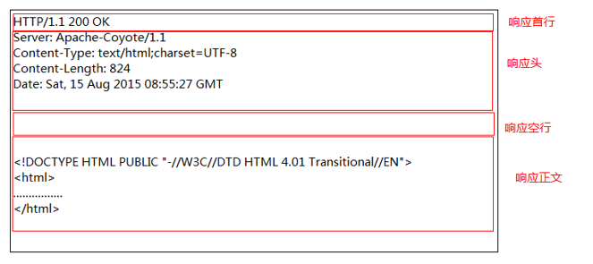

#暴走篇

##一、  四大组件、 UI 布局及数据存储

###1.Activity 的生命周期

####Activity从创建到和用户交互的过程
	[1]onCreate(),创建了Activity,可以初始化数据,但是不宜做耗时操作,它有一个Bundle的参数可以用来在Activity意外被销毁时进行保存,在onSaveInstanceState(Bundle outState)方法进行恢复

	[2]onStart(),Activity从不可见到可见,源码的注释和官方文档的生命周期图可以看到他在onCreate()和onRestart()方法之后会调用

	[3]onResume(),Activity获得焦点,从不可交互到可以进行交互了,源码的注释也说了这个方法适合开启动画或者打开相机等操作

####Activity从失去焦点到销毁的过程
	[4]onPause(),Activity失去焦点,从可以交互到不可以交互,当这个Activity开始不在栈顶的时候就算可见也是不可交互的. 通过源码可以发现这个方法主要是用来保存Activity正在编辑的一些数据和状态，提出一个“edit in place” 的模式给用户确保在内存不足的情况下不至于丢失数据。onPause()可以做一些停止动画和关闭资源访问等操作.
	补充:
		在以前的版本(至少在2012)是有8个周期的方法的时候是由onFreeze()方法进行保存状态的.然后再调用onPause()方法进行提交保存的状态.(onStop()-->onSaveInstanceState()-...->onCreate()) 

	[5]onStop(),Activity从可见到不可见.   接下来看操作,走onDestory()销毁Activity或者onRestart()重新开启页面

	[6.1]onDestory(),  销毁Activity,Activity页面销毁,多是存放如Bind绑定的服务和动态注册的广播,观察者模式等的取消.

	[6.2]onRestart(),  onStop()之后没有走onDestory(),再次可见页面, onRestart之后走onStart()

###2.横竖屏切换时 Activity 的生命周期
	默认情况下的横竖屏切换是Activity会重新创建一遍

*	在 2.3 的机器上，所⾛的⽣命周期⽅法流程如下：
		onSaveInstanceState->onPause->onStop->onCreate->onStart->onRestoreInstanceState->onResume

*	在 4.0 的机器上，所⾛的⽣命周期⽅法流程如下 ：
		onPause->onSaveInstanceState->onStop->onCreate->onStart->onRestoreInstanceState->onResume

####怎么样解决横竖屏切换 Activity 重新创建的问题呢?
	有两种⽅法：
	(1)直接写死屏幕朝向为竖直或者横向。//清单
		android:screenOrientation="landscape"//横屏
		android:screenOrientation="portrait"//竖屏
	
	(2)让activity可以切换屏幕方向,又不会重新销毁重建//清单
	android:configChange="orientation|screenSize|keyboard"
	最好3个都设置,避免版本问题.因为不同版本单独写几个是不同的

###3.如将 Activity 设置成窗口模式？
	在 manifest 中给该 Activity 设置如下属性：//主题
	android:theme=”@android:style/Theme.Dialog

###4.Actvity 的 4 种启动模式
	Activity 的启动模式一共有四种，分别是 standard、singleTop、singleTask、singleInstance。

	[1]standard默认启动模式,直接叠加到栈顶
		启动activity不论有没有在栈中都会创建
		后进栈的先出栈的原则, 每开启一个activity都会加到任务栈的栈顶.
		
	[2]singleTop 单一栈顶模式,复用顶部
		如果当activity已经在栈顶的话，就不再创建并添加//栈顶复用
		
	[3]singleTask 单一任务模式,以上清除
		如果在栈中有当前activity，再启动当前activity，就将上面的全部activity移出栈，让当前activity在栈顶(简单理解:用旧的,以上清除)

	[4]singleInstance 单一实例模式,自己一个栈
		当启动当前activity 需要创建一个单独的栈存放当前activity,并且该任务栈只有一个这个实例存在。
		任务栈A和任务栈B之间的执行顺序回互相调换.

####怎么样设置 Activity 的启动模式？
	有2种方式:清单文件manifest和启动的时候代码设置标记flag
	
	[1]在清单文件manifest通过属性launchMode定义.	
	[2]intent.addFlags()
		FLAG_ACTIVITY_CLEAR_TOP  模式singleTask
		FLAG_ACTIVITY_SINGLE_TOP 模式singleTop
		FLAG_ACTIVITY_NEW_TASK	 创建一个新的任务栈来放置目标 Activity,有点类似standard模式

####启动模式是 singleTop 的 Activity，当它在栈顶时再次试图启动它会发生什么？
	栈顶复用,不会重新创建该 Activity 的实例,源码中是这样操作的:
	它会回调 Activity 的 onNewIntent(Intent intent)方法，但是此时 getIntent()方法返回的还是原来的 intent 对象，然而我们可以通过 setInten(intent)方法来更新intent

####四种启动模式的应用场景？
	a).standard:默认的都是用这种模式。
	
	b).singleTop:例如接收消息后显示的界面，QQ 接收消息后立马弹出界面，当一次性接收 100 个消息，不可能弹出一百个界面吧。浏览器的书签.
	
	c).singleTask:适合作为程序的入口点，例如浏览器的主界面，无论从多少个应用程序打开浏览器，都只会启动一次主界面不会重复创建。
	
	d).singleInstance:适合做与应用程序分离的界面，例如：来电界面，它的特点是会创建一个单独的且与用户正在交互的界面的任务栈，它会一直在前端直到所有Activity 全部退出。

###5.怎么保存 Activity 的状态？
	首先
		只有当 Activity 被意外回收时才需要去保存 Activity 的状态和某些数据.（意外回收就是指没有调用 finish 方法，但是 Activity 被销毁了）一般情况下Activity 的状态会自动保存，我们这里说的保存状态是说的一些额外的需要保存的状态和数据。
	
	然后
		通过重写 onSaveInstanceState(Bundle outState)方法来进行数据和状态的保存.	在onCreat(Bundle saveInstanceState)中会取出恢复.
		onSaveInstanceState()是在 onStop 之前被调用的，但是没法确定是在 onPause 之前或之后调用。
	
	注意：只有当 Activity 意外销毁时才会调用该方法，如果 Activity 是调用 finish 方法销毁的则不会调用该方法.

###6.描述一下 BroadcastReceiver 的生命周期
	这个题目,老师遇到坑了
	
	在接收到广播的时候创建，当 onReceiver()方法执行完就结束了。
	
	广播的生命周期很短暂，所以最好不要在广播接收者中创建子线程和服务之类的，因为广播接收者被销毁后就成了空进程很容易被系统回收.

###7.BroadcastReceiver广播接收者的注册方法
	方式1:静态注册: 清单配置
		<receiver  name="广播接收者">
			 <intent-filter >
				<action name="要接收的广播"/>
					(一般情况不需要data)有时候还需要配置约束<data scheme="">===>SD卡广播需要写"file"   应用的安装和卸载广播需要写"package"
			 </intent-filter >
		</receiver>

	方式2:动态注册: 代码配置
		好处:节省内存（记得销毁的时候取消注册）
		
		创建广播接收者类 对象=new 广播接收者类();
		//意图过滤器----设置意图动作
		IntentFilter filter = new IntentFilter();
		filter.addAction("android.intent.action.SCREEN_OFF");
		filter.addAction("android.intent.action.SCREEN_ON");
		//注册广播接收者:传入广播接收者,意图过滤器
		registerReceiver(广播接收者对象, filter);

		动态注册一般是在 Activity 或者 Service 中进行注册，当 Activity 或 Service 被销毁的时候，就接收不到广播了。
		
		取消注册:重写onDestroy()方法,取消注册:unregisterReceiver(广播接收者对象);防止内存泄露

###8、 你在项目中使用过广播接收者吗//多用EventBus来实现
	广播接收者的作用主要是通信
	
	[1]如果要监控系统的变化：如开机、SD 卡挂载状态、电量状态、收到短信、WIFI 状态切换等等。
	
	[2]使用广播接收者可以很好地进行多线程之间的频繁通信，因为广播本来就是双向的（A 线程可以向 B 线程发广播，同理 B 线程也可以向 A 线程发）。这样的话比用 Handler 就要好，因为 Handler 是单向的。

	[3]广播接收者还能用于 Fragment 和 Activity 之间或者不同组件之间通信。但是由于用广播接收者的话代码比较冗余，现在涉及到这方面的需求一般都使用EventBus来实现.

###9、默认情况下，Service 中是否能做耗时操作?
	[1]默认情况下 service 也是运行中 app 所在进程的主线程中，肯定是不能做耗时操作的。
	
	[2]但是我们可以通过在 manifest 中指定它的 process进程 属性，让他在另外一个进程中运行，这样的话就可以做耗时操作了.

###10、 描述一下两种启动 Service 的方式及其各自的生命周期?
	2种开启方式(start开启服务/bind绑定服务)
	
	[1]startService：用这种方式启动的 service 由于没有和 Activity 进行绑定，所以可以长期在后台运行但不能调用服务里的方法。
	start方式的生命周期
		完整:		onCreate()----onStartCommand()----onDestory()
		第一次开启:	onCreate()----onStartCommand()
		停止服务:	stopService()----onDestory()
		多次开启:	多次执行onStartCommand()
		多次停止:	onDestory()只执行一次//stopService()是不是多次执行呢
	[2]bindService：用这种方式启动的 service 会和 Activity 进行绑定，所以不能长期在后台运行但是能调用服务里面的方法。一个服务可以被多个客户（一般指 Activity绑定）.只有当所有被绑定的对象都调用了 onUnbind()方法，该 service 才算销毁.
	bind方式的生命周期.
		完整:		onCreate()----onBind()-----unUnBind----onDestory()
		第一次开启:	onCreate()----onBind()
		停止服务:	onUnBind()----onDestory()
		多次开启:	没有任何
		多次停止:	会报错

####start方式和bind方式的区别
	start:
		[1]生命周期的区别:
			完整生命周期 - onCreate - onStartCommand - onDestory
		[*2*]特点:	
			服务一旦被开启，就会在后台长期运行，直到用户手动停止.	开启服务后和activity没有关系
		[3]服务设置页面:
			开启服务后可以在服务设置页面看到.
		[4]传递数据:
			可以通过intent将数据传递给service//在onStartCommand(Intent intent,,,,,,,)可以接收Intent
				
	bind:
		[1]生命周期的区别:
			完整生命周期 onCreate - onBind - onUnbind - onDestory
		[*2*]特点:	
			服务要和activity一起销毁。不求同时生，但求同时死,指的是调用者(Activity)和服务之间。
		[3]服务设置页面:
			开启服务后不能在服务设置页面找到，相当于是一个隐形的服务。
		[4]传递数据:
			可以通过intent将数据传递给service(bind方式是onBind(Intent intent))，还能从service中获取数据/调用服务的方法(Binder)
				
	重要的是:bind方式可以调用服务里面的方法(数据),start方式"不能"(new出来的 和startService不是同一个对象).
	

###11、 Service 和 IntentService 的对比
	[1]Service 默认是运行在 app 运行的进程的主线程中，我们不能在里面做耗时操作。
	
	[2]IntentService 是 Service 的子类，它会创建一个工作线程worker-Thread来处理所有的 Intent 请求。执行完一个 Intent 对象的请求后，如果没有新的 Intent 请求到达，则会自动停止 service 不用你去调用 stopservice 方法。
	
	[3]IntentService 处理事务时是采用的 handler 方式，创建了一个名为 ServiceHandler的内部 Handler，并把它直接绑定 HandlerThread。ServiceHandler 把处理 Intent所 对 应 的 事 务 都 封 装 到 onHandleIntent 方法中，我们可以直接实现onHandleIntent 方法再在里面根据 Intent 的不同进行不同的事务处理。
	
	[4]区别:Service是UI线程执行的,IntentService的onHandleIntent()是后台执行.	Service没停止就会一直在后台存在,IntentService执行完就自动销毁.

###12、 如何确保一个 Service 不会在系统内存不足的情况下被杀死？
	[1]属于后台进程，所以在系统内存不足的情况下可能会被清理掉,但是一般不会杀到后台进程
	
	[2]前台进程是不会在系统资源不足的情况下被自动清理掉的，所以要确保 Service 不会被杀死我们可以想办法让它变成一个前台进程.[在启动服务的时候使用 startForeground 方法将 Service 就变成前台进程。]经过实测，使用该方法能降低被 kill 的概率但是不能确保不被 kill.//如果我们到应用详情页面，点击force Stop按钮，则会强行停止服务，此时是不会走服务的onDestroy方法的.重点:startForeground(100, notification);//参数1是通知栏的标识

	[3]还能通过在 onDestroy()方法中发送广播，在广播接收者中重启服务。但是当使用第三方应用强制 Kill 服务的话，连onDestroy()方法都进不来，所以还是无法确保.

	[4]使用双 Service 守护，两个 Service 不断相互判断对方是否存活，如果发现对方被杀死则立马将其重新开启.

###13、 你的项目中使用过 Service 吗？
	当然用过,不能放在 Activity 中来执行的工作就必须得放到 Service 中去做。如：音乐播放、下载、上传大文件、定时关闭应用等功能。
	因为这些功能如果放到 Activity 中做的话，那 Activity 退出被销毁了的话，那这些功能也就停止了，这显然是不符合我们的设计逻辑的，所以要将他们放在 Service 中去执行.
	

###14. 简单描述一下 ContentProvider 内容提供者
	ContentProvider应用为存储和获取数据提供统一的接口,可以在不同应用程序之间实现数据共享。
	它提供了 query、insert、delete、update、getType、onCreate 等方法，使用 ContentProvider 首先要定义一个类继承ContentProvider，然后再覆写 query、insert、delete、update 等方法.
	当然作为四大组件之一必须在 manifest 中注册。外部应用可以通过 内容解析者ContentResolver 来访问该内容提供者提供的数据.
	

###15、写一条创建表的 sql 语句。
	字段说明:系别编号 系名称 系主任 字段名称 depNo depName depMan。
	create table Depart(depNo int primarykey,depName varchar(50) not null,depMan varchar(50) not null)
	一般我是先写在SQLite软件上,执行成功才拷贝到代码里的.不管熟悉不熟悉都避免小错误导致代码奔溃.

##二、 其他基础部分。

###1、说说ListView的优化？
	ListView的优化可以从ListView和Adapter、ViewHolder三大块入手：
	1)、从Adapter入手。
		(1).在adapter中的getView方法中尽量少使用逻辑
		(2).尽最大可能避免GC
		(3).滑动的时候不加载图片
		(4).将ListView的scrollingCache和animateCache设置为false
		(5).item的布局层级越少越好
		(6).使用ViewHolder

	2)、从ListView入手。
		如果多层嵌套无法避免的情况下，建议把listview的高和宽设置为	match_parent. 
		如果是代码继承的listview，那么也请你别忘记为你的继承类添加上LayoutPrams，注意高和宽都是match_parent的。

	3)、从ViewHolder入手。
		将缓存类ViewHolder设置为静态类也就是static，静态类只有在首次加载的时
		候比较耗时，后面就可以直接使用了，同时保证了，内存中只会有一个
		ViewHolder，节省了内存的开销

##2、 常见的Java设计模式

###单例模式
	定义：一个类有且仅有一个实例，并且自行实例化向整个系统提供。
	实现步骤：
		(1).私有化构造函数。
		(2).自行实例化对象。
		(3).提供一个公有方法向整个系统提供该实例化对象
	按创建时机可以分成两种：饿汉式和懒汉式。
		饿汉式：类加载时创建，线程安全。
		懒汉式：在使用时判断，如果需要再创建。线程不安全，在多线程并发访问的情况下，可能会产生多个实例对象.

####怎么来解决懒汉式线程不安全的问题呢？
	[1]先检测是否为空，如果为空再对该单例类.class加锁，再判断一次是否为空。这样既解决了线程安全问题，也避免了每次使用单例都要加锁带来的系统资源消耗/
		public class Singleton{
			private Singleton(){}
			//[4]终极版本:volatile
			private static volatile Singleton defaultInstance;
			//就是在对象加个关键字,  其他同[3],volatile作用是禁止指令重排,
			//[3]两个非空，一个加锁*******高效但有缺陷
			public static Singleton getDefault() {
				if (defaultInstance == null) {
					synchronized (Singleton.class) {
						if (defaultInstance == null) {
							defaultInstance = new Singleton();
						}
					}
				}
				return defaultInstance;
			}	
		}

	[2]使用静态内部类
		public class Singleton {
			private SingletonO {}
			private static class Singletonlnstance {
				private static final Singleton INSTANCE = new Singleton();
			}
			public static Singleton getlnstance() {
				return Singletonlnstance.INSTANCE;
			}
		}
		优点:
			[a]实例在静态内部类加载的时候创建，一定是单例的。
			[b]不会过早创建，只有在内部类被使用的时候会创建。
	
	[3]使用枚举创建单例
		最牛逼的实现单例的写法，不仅避免多线程并发访问的问题，还能防止反序列化重新创建新的对象。
		public enum Singleton{
			INSTANCE;
			public void whateverMethod(){}
		}

####单例模式在项目中的应用？
	例如使用工厂模式时的工厂类、登录成功后的用户类我们都可以使用单例模式来实现。

###工厂模式

####[1]简单工厂模式
	定义：只有一个工厂类，通过想创建方法中传入不同的参数，来生产不同的产品。代码如下

	优点：能够根据外界给定的信息，决定应该创建哪个具体类对象。用户在使用时可以无需了解这些对象是如何创建的，有利于整个软件体系结构的优化。
	缺点：违背面向对象设计的“开闭原则”和“单一职责原则”。因为我们每增加一个产品就要去修改工厂类的代码

####[2]工厂方法(用的多)
	定义：定义一个创建对象的接口（抽象工厂类），让其子类（具体工厂类）去决定实例化哪个类（具体产品类）。一个工厂实现一种产品，一对一的关系。

	优点：符合面向对象设计的“开闭原则”和“单一职责原则”。
	缺点：每增加一个产品都要增加相对应的具体产品类和具体工厂类，使得系统中类的个数成倍增加，在一定程度上增加了系统的复杂度，同时也增加了系统具体类的依赖。

####[3]抽象工厂模式
	定义：提供一个创建一系列相关或者相互依赖产品的接口，而无需制定他们的具体类，一对多的关系。抽象工厂模式是工厂方法模式的升级版。
	优点：即符合面向对象设计的“开闭原则”和“单一职责原则”。又减少了系统中的类的数量，不用像工厂方法一样每生产一个产品都要有一个具体的工厂类.
	

###观察者模式。
	定义：又名发布—订阅模式，对象间的一种一对多的依赖关系，当一个对象的状态发生改变时，所有依赖于它的对象都得到通知并被自动更新。

	组成部分：
	1).抽象目标角色(Subject)：目标角色知道它的观察者，可以有任意多个观察者观察同一个目标。并且提供注册和删除观察者对象、通知观察者的方法。目标角色往往由抽象类或者接口来实现。
	2).抽象观察者角色(Observer)：为那些在目标发生改变时需要获得通知的对象定义一个更新接口，里面有一个更新数据的方法。抽象观察者角色主要由抽象类或者接口来实现。
	3).具体目标角色(Concrete Subject)：实现Subject，实现添加、删除观察者、通知观察者的方法，当它的状态发生改变时, 向它的各个观察者发出通知。
	4).具体观察者角色(Concrete Observer)：实现Observer的更新接口以使自身状态与目标的状态保持一致，获取通知进行更新.

	

###适配器模式
	定义：将一个类的接口，转换成客户期望的另一个接口。使原来由于接口不兼容而不能一起红枣的那些类可以一起工作.。
	分类：单接口适配器模式和对象适配器模式
	作用: 如果我需要实现该接口了, 可以直接继承该抽象类, 只重写我们需要的方法即可

	[1]单接口适配器模式:
		定义一个Adapter类实现A接口，所有方法都是空实现，然后让B类继承Adapter类，选择性实现自己需要的方法。

	[2]对象适配器模式
		

###3、 描述一下Fragment的生命周期。

####Fragment创建过程：
	1).onAttach(Context context):当Fragment第一次依附到context上时调用。在早期版本SDK上时onAttach(Activity activity)。
	2).onCreate:初始化Fragment。
	3).onCreatView:初始化Fragment的视图。
	4).onActivityCreated():当fragment所依附的Activity创建和Fragment的视图实例
	化完成后调用。
	5).onStart():Fragment由不可见变为可见时调用。
	6).onResume():Fragment获取到焦点是调用。

####Fragment的销毁过程：
	1).onPause():Fragment失去焦点时调用。
	2).onStop():Fragment变为不可见时调用。
	3).onDestroyView():Fragment的视图被销毁时调用。
	4).onDestroy():Fragment不再使用了，被销毁时调用。
	5).onDetach():Fragment不再依附Activity时调用

###4.Fragment和Activity之间、Fragment和Fragment之间如何进行数据传递？
	[1]目前最流行的数据传递方式就是使用EventBus，自定义一个事件类，在要发送消息的地方用EventBus对象发送该事件，在要接收消息的地方使用eventBus.register(this)方法，然后再接收的地方实现(onEvent、onEventMainThread、onEventBackGroundThread、onEventAsync)这四个方法中的一个来接收发送过来的事件。
	
	[2]如果不使用EventBus的话//以下做法不推荐
		Fragment和Activity:  主要是通过getActivity()获取到Activity和Activity通信
		Fragment和Fragment:	 
			Activity开启Fragment的时候添加tag  如"movie"
			在某Fragment通过Activity拿到Fragment管理者拿到对应的Fragment来"通信"-->getActivity().getFragmentManager().findFragmentByTag("movie");

###5、 Fragment如何实现类似Activity任务栈的压栈和出栈效果？
	往Actvity中添加Fragment默认是不会添加到任务栈的,因为一直新建栈，不会有Activity那种压栈和出栈的效果。要实现这种效果我们可以通过如下步骤实现:
	添加后退栈：tr.addToBackStack(name)//tr是事物
	//孩子管理器是getChildFragmentManager
	监听后退栈:孩子管理器.addOnBackStackChangedListener
	要退出Fragment的时候//重写onBackStackChanged()方法
		[1]拿到回退栈的总数	：孩子管理器.getBackStackEntryCount()
		[2]如果回退栈>0，说明有孩子在Fragment栈里(栈是从0开始)
		[3]获取栈顶元素(当前栈)：孩子管理器.getBackStackEntryAt(栈总数-1)（栈是从0开始）
		[4]返回上一个栈: 孩子管理器.popBackStack()

#大杀特杀篇

###1、 View 的绘制流程。
	View 的绘制是从 ViewRoot 的 performTraversals()方法开始的
	iew 的绘制分为三个步骤：measure、layout、draw. 但是他们final并调用了onMeasure,onLayout,onDraw方法让我们进行绘制.

	[1]measure测量---(measure -> onMeasure)-->控制View的大小
		a)作用:measure 过程对整个 view 树的所有控件的宽高进行计算
		
		b)源码:
			measure是从 ViewRoot 类中的 host.measure 开始的部调的是 View的measure(),measure()调用了onMeasure().
			测量工作在onMeasure方法里面,实质是onMeasure方法调用了setMeasuredDimension()来测量宽高.
			而setMeasuredDimension保存测量的宽高的值(接收,赋值到成员变量mMeasuredWidth，mMeasuredHeight,后面需要调用)
			获得期望的宽:getMeasuredWidth()//同理长度等
		c)重写这个方法:
			onMeasure(int widthMeasureSpec, int heightMeasureSpec)
				参数:
					widthMeasureSpec 跟layout_width有关的，父容器(使用了自定义控件的父容器)对孩子（MyView）的宽度期望
					heightMeasureSpec 跟layout_height有关的 父容器(使用了自定义控件的父容器)对孩子（MyView）的高度期望
				而这2个参数是int类型,是32位二进制组成:前2位代表[模式],后30位代表[控件大下]
				模式(前2位):
					//public static final int UNSPECIFIED = 0 << MODE_SHIFT; //未指定的模式，父容器（RelativeLayout）对孩子没有大小的限制，孩子想多久多大.[**我们只在绘制特定情况的自定义 view 才用得到此模式**]
					//public static final int EXACTLY     = 1 << MODE_SHIFT;//指定模式//精确地测量模式，父容器（RelativeLayout）对孩子有确切的大小要求，大小就是后30位
					//public static final int AT_MOST     = 2 << MODE_SHIFT;//指定最大值模式，父容器对孩子的最大值，最大值后30位
				大小(后30位):
					int mode = MeasureSpec.getMode(widthMeasureSpec);//拆出模式(进行了位运算),获得模式值还要mode>>30
					int size = MeasureSpec.getSize(widthMeasureSpec);//拆出大小(进行了位运算)
					//控件的真实大小和模拟器分辨率有关,标准的好像是320*480就是1px  ,此时1dp=1px
										具体看dpi比率
				//必写: 测量和设置子view的大小
				childView.measure(要设置的宽,要设置的高);
						获取view的宽度：childView.getMeasuredWidth()//同理长度等			
					
		d)解释onMeasure()中调用子View.measure()测量孩子
			源码:measure()是final类型的方法，调用了onMeasure()，onMeasure()调用了setMeasuredDimension()
			measure()是父控件调用的，做了什么？
				[1]父控件通过这个方法限制孩子的宽高
				[2]子控件申请  TODO
				[3]父控件调用这个方法，参数传入2个期望值，匹配
				[4]父控件.measure()调用onMeasure()，onMeasure()调用setMeasuredDimension()进行控件值的保存

	[2]layout布局--( 方法:layout(l,t,r,b) )--->控制View的位置 
		a)作用：
			ViewGroup 用来将子 View 放在合适的位置上。
		b)源码:
			ayout 是从 ViewRoot 类中的 host.layout 开始的，内部调的是 ViewGroup的 layout(),
			layout->setFrame() 完成了对四个成员变量的赋值mLeft, mTop, mRight, mBottom,再调用 onLayout 方法来确定子 View 的位置
		
		c)重写这个方法onLayout():
			四个位置l, t, r, b 相对于父容器
			子View.layout();//父容器发起孩子的布局，调用孩子layout方法，传入四个位置
			View 一般不需要重写 onLayout 方法，因为它的位置是由父控件来确定的。

	[3]draw绘制--(draw--> onDraw)--->View的绘制 
 		a)作用：
 			真正将内容展示在屏幕上让我们能够看到

		b)源码：
			draw 是从 ViewRoot 类中的 host.draw 开始的，内部调的是 View 的 draw方法.要去实现onDraw方法绘制控件,同样的是draw()是父控件调用，draw--> onDraw()
		
		c)重写这个方法onDraw()
			画自己自定义的控件，重写(注意该方法是空方法(在继承View是空方法))
			注意事项：不要在onDraw里面创建对象，因为onDraw()的调用非常频繁
			常用的是用画布Canvas 和画笔Paint进行绘制

			可以通过invalidate或者postInvalidate方法要求系统重新绘制
				invalidate()是在UI线程自身中使用.
				postInvalidate()是在非UI线程中使用,它用了Handler更新UI.

####Paint 中常见的 API：
	1).setColor，设置颜色。
	2).setColorFilter,设置颜色过滤。
	3).setAlpha,设置透明度。
	4).set(Paint paint)，直接将另外一支画笔的属性设置给这支画笔。
	5).setStyle，设置是填充还是描边。
	6).setTextSize,设置文字大小。等等

####Canvas 常见的 API：
	1).drawArc，画弧形。
	2).drawCircle，画圆形。
	3).drawBitmap，画 Bitmap。
	4).drawLine,画直线。
	5).drawOval，画椭圆。
	6).drawRect，画矩形。
	7).drawPath，画路径，该方法可以画出很多奇形怪状的形状。
	8).rotate,旋转画布。
	9).translate,平移画布。
	10).save,保存画布状态，一般是在旋转或者平移之前可以保存画布状态，便于还原。
	11).restore,还原画布状态，调用这个方法之前肯定调用 save 来保存了状态。

###2,ViewGrou的绘制流程
	[1]需要测量孩子childView.Measure()
		先拿到孩子申请的宽高进行测量操作
		[a]ViewGroup的onMeasure()方法拿到孩子申请的宽高进行测量
		[b]重点:调用子View的Measure()方法进行测量:   childView.Measure()
			====>子View会做如下操作:  被父容器调用了Measure()--->onMeasure()--->setMeasureDxxxx()进行值的保存等
		[自动测量写法]
			//自动测量
	        measureChildren(widthMeasureSpec, heightMeasureSpec);
			//向上传递
	        super.onMeasure(widthMeasureSpec, heightMeasureSpec);
	
	[2]需要摆放孩子的位置childView.layout()
		[a]ViewGroup的onLayout()方法拿到孩子申请的位置
		[b]重点:调用[所有孩子]的layout()方法进行摆放.(有几个孩子写几个孩子.layout)
			childView.layout(left, top, right, bottom);
		
	[3]需要绘制孩子dispatchDraw()+childView.draw()//ViewGroup帮我们实现了
		一般不实现onDraw画自己,只需要画孩子(dispatchDraw(),ViewGroup已实现)
		onDraw()调用了dispatchDraw()
			dispatchDraw()调用了孩子的draw()方法,   孩子自己写了onDraw()
	

##View和ViewGroup绘图三部曲的区别
	ViewGroup的测量
		相同点:measure -> onMeasure
		不同点：作为一个父容器，需要去测量孩子，拿到孩子申请的宽高(mChild.getLayoutParams().width等)，打包成对孩子的期望(MeasureSpec.makeMeasureSpec(size,mode))，去测量孩子（child.measure()）

	ViewGroup的布局
		相同点:layout(l, t, r, b),layout (父容器调用) -> onLayout
		不同点:ViewGroup要去覆写onLayout,去布局孩子，调用孩子layout方法，指定孩子上下左右的位置.	View一般不需要重写onLayout(),由父控件决定自己的位置

	ViewGroup的绘制
		相同点:draw -> onDraw
		不同点：ViewGroup一般不会去画自己，ViewGroup默认实现了dispatchDraw去绘制孩子（child.draw）

###4、说说对Http协议的理解
	定义： 
		http（超文本传输协议）是一个基于请求与响应模式的、无状态的、应用层的协议，常基于TCP的连接方式
		是一套通讯的规范,决定了通讯的格式
	
	被问到具体的键和值是什么意思,回答里面太多内容,虽然不能都答的上来,但是基本的要知道+说自己的笔记有写的很清楚.	
	
	主要特点:
		1.支持客户/服务器模式。
		2.简单快速：客户向服务器请求服务时，只需传送请求方法和路径。请求方法常用的有GET、HEAD、POST。
		3.灵活：HTTP允许传输任意类型的数据对象。正在传输的类型由Content-Type加以标记。
		4.无连接：限制每次连接只处理一个请求。服务器处理完客户的请求，并收到客户的应答后，即断开连接。可以节省传输时间。
		5.无状态：HTTP协议是无状态协议。

HTTP请求结构图

	[Request]请求的组成结构:
		由请求行、请求头(消息报头)、请求体(请求正文)组成
				//消息报头包括普通报头、请求报头、响应报头、实体报头
		请求方法一共有八种，但是我们 Android 中常用的只有 GET 和 POST 两种。
		(只需要弄懂 GET 和 POST 及其区别，需要装逼的请记住八种)
		(1).GET：请求获取 Request-URI 所标识的资源。
		(2).POST：在 Request-URI 所标识的资源后附加新的数据。
		(3).HEAD：请求获取由 Request-URI 所标识的资源的响应消息报头。
		(4).PUT：请求服务器存储一个资源，并用 Request-URI 作为其标识。
		(5).DELETE：请求服务器删除 Request-URI 所标识的资源。
		(6).TRAC：请求服务器回送收到的请求信息，主要用于测试或诊断。
		(7).CONNECT：保留将来使用。
		(8).OPTIONS：请求查询服务器的性能，或者查询与资源相关的选项和需

		a). 请求行：请求方式、请求 URI 和 协议版本
			GET 和 POST 的区别：
				(1).用 GET 提交表单数据只经过了简单的编码(不安全)，参数键值对拼装在Url地址之后。
					POST 请求提交数据更加安全,参数不在Url上.
				(2).各种浏览器对 URL 的长度有限制.	GET 请求提交的数据量较小。
					POST请求提交的数据量较大(理论上参数长度没有限制)。
				(3). 服务器取值方式不一样。GET方式取值，如php可以使用$_GET 来取得变量的值，
					而POST方式通过$_POST 来获取变量的值。
				(4)在服务器解码的时间点不同,其他都相同.
					get解码时间点是 请求一旦到达服务器就会立刻解码参数
					post解码时间点是	调用获得参数方法时才会解码
					
		b)请求报头：键值对.请求报头允许客户端向服务器端传递请求的附加信息以及客户端自身的信息。
			//如果需要知道的话
			Host:	请求地址及端口
			Connection: kepp-alive	连接方式,(是否需要保持)允许复用链接
			Content-Length：请求内容长度。
			Cache-Control:缓存机制
			User-Agent: 允许客户端将它的操作系统、浏览器和其它属性告诉服务器。用户代理字符串, 浏览器标识 发送浏览器的信息,比如浏览器版本号
			Content-Type： 请求内容类型
			Referer :	 页面来源(从哪里链接过来的), 可用于防盗链
			Accept-Encoding: 可以支持的压缩方式/编码. 没设置则表示任何内容编码都能接受
			Accept-Language: 可以接受的语言, 可以实现国际化
			Cookie:保存信息到浏览器中.作用是将 cookie 的值发送给 HTTP 服务器
			application/x-www-form-urlencoded：标准的编码格式，数据被编码为名称/值对。
			Accept: 可接收文件类型. 例如Accept：image/gif 表示希望接收 gif 图。
			Accept-Charset: 用 于 指 定 客 户 端 接 受 的 字 符 集 。 例 如 ：Accept-Charset:gb2312

		c)请求体:
			只有post提交时才有正文.表单提交参数的键值对
			例如是post请求的话有:name=...&password=.....：请求的内容。而如果是get请求,这些数据在url地址后面.

HTTP响应结构图

	[Response]响应的组成结构：
		由状态行(响应首行)、状态报头(响应头)、响应正文(响应体)
		
		a).状态行：包含协议版本号、响应状态码、状态码描述。
			1XX——指示信息，表示请求已接受，继续处理。
			200——请求成功。//206	部分请求成功
			3XX——重定向。(例子:旧地址引导到新地址)
			403——服务器收到请求，但拒绝进行处理。404——资源不存在客户端自己的错误(C/S  B/S )。
			500——服务器发生不可预期的错误。	服务器内部错误.包括空指针异常

		b).响应报头：键值对,附加响应信息
			Server：		服务器标识/类型
			Accept-Ranges: 是否允许接收部分请求( bytes表示允许)
			Set-Cookie：	浏览器Cookie
			Last-Modified: 缓冲控制有关
			Content-Type：响应/返回内容类型
			Content-Length：响应/返回内容长度
			Date：响应的时间/报文响应的时间
			Location:用于重定向接受者到一个新的位置。常用在更换域名
		
		c).响应正文:请求的资源会在响应正文中发送.

